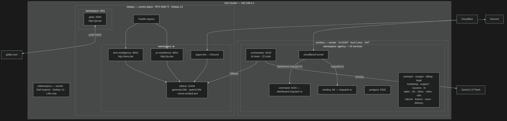

# k3s-homelab

A complete 3-node k3s homelab built over a weekend (May 2026), running two production namespaces: a clinical AI platform with RTX 5060 Ti GPU inference, and a 24-service AI agency stack migrated live from Podman.

> **This is a build narrative, not a live status page.** Phases 1-4 below are historical
> record of what was actually built at the time and are left as-is. For current cluster
> state (node list, k3s version, what's pinned where), see
> [homelab-infra](https://gitlab.com/molszewski423/homelab-infra) — that repo's docs are
> the ones kept in sync with reality. This file gets new phases appended for major events,
> not rewritten.

---

## What Was Built

Starting from three bare Linux machines on a home LAN, the following was operational by end of the weekend:

- k3s v1.35 cluster, 3 nodes joined and healthy
- RTX 5060 Ti GPU exposed to Kubernetes via NVIDIA device plugin + RuntimeClass
- Ollama running in a GPU pod, 5 models loaded and serving inference
- Two clinical AI Streamlit apps with Traefik ingress (`pv.lan`, `ams.lan`)
- Argus Discord bot connected to pv-workbench backend
- GitLab CI/CD building and deploying images on push to main
- 24 agency services migrated from Podman systemd quadlets to k3s - live, no data loss
- PostgreSQL 16 data preserved via hostPath PVCs (zero dump/restore)
- Cloudflare tunnel routing `ringcatch.io` and `dashboard.ringcatch.io` through the cluster

---

## Architecture



---

## Why k3s

| Option | Reason rejected |
|---|---|
| Podman systemd quadlets | No rolling updates, ingress, or health-based scheduling. UID remapping breaks volume permissions across nodes. Works for single machine; brittle across 3. |
| Docker Compose / Swarm | Swarm is in maintenance mode. Compose is single-host. |
| kubeadm (full k8s) | etcd overhead, complex bootstrapping, overkill for a homelab. |
| k3s | Single binary, embeds containerd + Traefik + CoreDNS + local-path-provisioner. CNCF-conformant. Joins a node in under 2 minutes. Production-grade Kubernetes API. |

---

## Phase 1 - Cluster Setup

### Control plane (MikePC)

```bash
curl -sfL https://get.k3s.io | sh -
sudo cat /var/lib/rancher/k3s/server/node-token   # save this for workers
```

### Workers (archbox, MikeInspiron)

```bash
# Fish shell requires `env` for inline variable assignment
curl -sfL https://get.k3s.io | env K3S_URL=https://192.168.4.54:6443 K3S_TOKEN=<token> sh -
```

### NVIDIA GPU (MikePC)

k3s **auto-configures the NVIDIA container runtime** - no manual `config.toml.tmpl` needed. Install the toolkit, configure it, restart k3s:

```bash
sudo apt install nvidia-container-toolkit
sudo nvidia-ctk runtime configure --runtime=containerd
sudo systemctl restart k3s
```

Deploy the device plugin:

```bash
kubectl apply -f https://raw.githubusercontent.com/NVIDIA/k8s-device-plugin/main/deployments/static/nvidia-device-plugin.yml
```

Create a RuntimeClass (required - resource limits alone are not enough):

```yaml
apiVersion: node.k8s.io/v1
kind: RuntimeClass
metadata:
  name: nvidia
handler: nvidia
```

GPU pods must declare both:

```yaml
spec:
  runtimeClassName: nvidia
  containers:
    - resources:
        limits:
          nvidia.com/gpu: "1"
```

---

## Phase 2 - Clinical AI Platform (namespace: ai)

All pods use `nodeSelector: kubernetes.io/hostname: mikepc` to pin to the GPU node. Manifests: [`homelab-infra/k8s/`](https://gitlab.com/molszewski423/homelab-infra).

**Ollama** runs as a GPU Deployment with a PVC for model storage. Models are pulled via `kubectl exec`:

```bash
kubectl exec -n ai deploy/ollama -- ollama pull gemma4:26b
```

**pv-workbench** and **ams-intelligence** are built by GitLab CI on every push to `main`/`master`, pushed to `registry.gitlab.com/molszewski423/<app>:latest`, and rolled out via `kubectl rollout restart`.

**Traefik ingress** (k3s built-in) routes `pv.lan` and `ams.lan` via LAN `/etc/hosts`:

```
192.168.4.54  pv.lan ams.lan
```

**argus-bot** is a second Deployment using the same pv-workbench image with CMD overridden to `python3 src/argus_bot.py`. Shares ChromaDB and output PVCs with the Streamlit pod.

---

## Phase 3 - Agency Migration (namespace: agency)

### Background

RingCatch ran as 24 Podman rootless systemd quadlets on archbox - one `.container` unit file per service, environment from `~/agency/.env`. Worked for a single machine. No rolling updates, no health routing, rebuilds required manual restarts.

### Approach

Each Podman unit → Kubernetes Deployment + Service. All 24 pinned to archbox via `nodeSelector`. PostgreSQL uses a hostPath PV pointing at the existing Podman volume data directory - no dump/restore required.

Secrets: `~/agency/.env` → `kubectl create secret generic agency-env --from-env-file=.env`

### Challenges Solved

**Podman UID mapping breaks hostPath volume permissions**

Podman rootless containers remap UIDs. Files written by Podman containers appear as uid `100999+` on the host. k3s/containerd runs containers with direct UIDs (no remapping). The container could not read its own data.

Fix: chown the data directories to the container's actual runtime UID before mounting as hostPath.

```bash
# n8n runs as node (uid 1000) in containerd
sudo chown -R 1000:1000 /path/to/n8n-data/
```

**localhost refs break when a Podman pod splits to k3s pods**

Inside a Podman pod, all containers share a network namespace - `localhost:8080` reaches any container. In k3s, each Deployment is an isolated pod. Every `localhost`/`127.0.0.1` service reference must become a Kubernetes DNS name.

```
# Before
ORCHESTRATOR_URL=http://127.0.0.1:8109

# After
ORCHESTRATOR_URL=http://agency-orchestrator:8109
```

This broke the command dashboard health checks (13 hardcoded `127.0.0.1` URLs) and the Discord bot alert path - all had to be updated to k8s service names.

**hostPort + rolling updates conflict**

Rolling updates create the new pod before terminating the old one. Two pods cannot bind the same hostPort simultaneously - the new pod stays `Pending`. Fix: either avoid hostPort (use Traefik ingress + ClusterIP), or manually delete the old pod before a rolling update.

**Local images not in k3s containerd**

Agency images were built locally with Podman and not in any registry. k3s/containerd cannot see Podman's image store. Fix:

```bash
# On archbox - export from Podman, import into k3s
podman save localhost/agency-orchestrator:latest | sudo k3s ctr -n k8s.io images import -
```

Manifests use `imagePullPolicy: Never`. Long-term: push to GitLab registry, let CI handle it.

**n8n encryption key mismatch**

The n8n `config` file had stored a literal placeholder `{N8N_ENCRYPTION_KEY}` as the encryption key (env var was never expanded in Podman). k3s injected the real value from the secret, causing a mismatch. Fix: delete the broken config file and let n8n regenerate it.

**Cloudflare tunnel initContainer (distroless image)**

The tunnel purge script used `/bin/sh` via an initContainer on the cloudflared image. cloudflared is distroless - no shell available. Fix: remove the initContainer and run the purge directly via the Cloudflare API instead.

---

## Phase 4 - Third Node (MikeInspiron)

Dell Inspiron joining as a 24/7 worker with lid closed. Sleep prevention required:

```bash
sudo systemctl mask sleep.target suspend.target hibernate.target hybrid-sleep.target
```

Hyprland configured for lid-close → display off, lid-open → display on via `bindl` - systemd-logind set to ignore lid events. The machine stays logged in for occasional local use.

Join command (Fish shell - note `env` syntax):

```bash
# Set token first - Fish does not support KEY=VAL cmd syntax
set TOKEN <node-token>
curl -sfL https://get.k3s.io | sudo env K3S_URL=https://192.168.4.54:6443 K3S_TOKEN=$TOKEN sh -
```

Despite this, MikeInspiron never durably showed up in `kubectl get nodes` after this
weekend — repeated join attempts, never confirmed stable. See Phase 5.

---

## Phase 5 - Third Node Reimaged (2026-07-25)

The MikeInspiron join from Phase 4 never actually stuck. Two months later, the same
physical Dell Inspiron was wiped and reimaged to **CentOS Stream 10**, rejoined as node
`centosbook` — the first time this node durably appears in `kubectl get nodes`.

Deliberately a different distro than the other two nodes (Debian on mikepc, Arch on
archbox) rather than a third identical image — keeps manifests honest about distro-specific
assumptions, and doubles as a standing environment for the RHEL/CentOS Stream ecosystem.

Two new problems surfaced immediately, both specific to this node:

**Tailscale silently breaks DNS for any pod scheduled here.** Tailscale on Linux rewrites
`/etc/resolv.conf` to point at its own MagicDNS resolver (`100.100.100.100`). CoreDNS has
no nodeSelector, so nothing stopped its single replica from landing on centosbook and
inheriting that resolv.conf — and MagicDNS wasn't reachable from the pod netns, so **every
DNS lookup cluster-wide failed**, including the Cloudflare tunnel's own lookups. Took
ringcatch.io down.

```bash
sudo tailscale set --accept-dns=false
kubectl rollout restart deployment/coredns -n kube-system
```

**firewalld drops forwarded pod traffic even with the right ports open.** Unlike
archbox/mikepc, CentOS Stream ships `firewalld` active by default. Its `public` zone only
covers the physical NIC — `flannel.1`/`cni0` aren't zone members, so traffic *forwarded*
from other nodes gets dropped even though the flannel VXLAN port (8472/udp) and kubelet
(10250/tcp) show as open in `firewall-cmd --list-all`. Fix: trust the cluster CIDRs instead
of fighting individual interface rules:

```bash
sudo firewall-cmd --permanent --zone=trusted --add-source=10.42.0.0/16   # pod CIDR
sudo firewall-cmd --permanent --zone=trusted --add-source=10.43.0.0/16   # service CIDR
sudo firewall-cmd --reload
```

Once both were fixed, `agency-landing` was moved here — the first `agency-*` service off
archbox, and the only one that could move without a storage migration (every other agency
service shares one `hostPath` PVC hard-pinned to archbox).

---

## Phase 6 - archbox Rebuilt as debianbox (2026-07-26)

archbox's last Arch update broke reboot reliability. Rather than keep chasing it, the box
was wiped and reinstalled as **Debian 13**, rejoined as a **new** k3s node named
`debianbox` — same hardware (i3-4130T), same LAN IP (192.168.4.45), new Tailscale IP
(100.80.218.77; the old 100.96.122.27 was retired). k3s identifies nodes by hostname, so
this was a real node replacement, not an in-place rename: the old `archbox` node object
was deleted from the cluster once `debianbox` was confirmed healthy.

This turned into the highest-risk step in the cluster's history so far, because archbox
held real persistent state, not just running pods — every `agency-*` hostPath PV
(postgres/n8n/data/voice) and the Prometheus/Grafana local-path volumes had `nodeAffinity`
hardcoded to the old hostname, and none of those pods could reschedule anywhere until every
one of those references was rebuilt to point at `debianbox`. Full restore order: base OS →
SSH host+user keys (restored byte-identical from backup, so `known_hosts` on other machines
never even flagged a mismatch) → Tailscale → nftables/CrowdSec/AdGuard → the four hostPath
volumes (verified against the pre-wipe `pg_dump` — row counts matched exactly) → k3s-agent
join → PV/PVC nodeAffinity rebuild (had to delete+recreate all four PVs, which required
force-clearing `pv-protection` finalizers since the bound PVCs blocked deletion) →
Prometheus/Grafana PVs (Delete-policy, discovered mid-migration that these are
operator-managed via `Prometheus`/`Alertmanager` CRDs — patching the generated StatefulSet
directly gets silently reverted by the operator's reconciliation loop, had to patch the
CRs instead) → `~/agency` + `~/homelab-infra` source restore → rebuild all 17 custom
`agency-*` container images from scratch, since none of them existed anywhere but the old
node's local containerd (no shared registry).

Two real build-environment bugs surfaced during the image rebuild, both looked identical
from the outside (a hung `podman build` with flat CPU and no error) but had unrelated
causes — worth knowing since diagnosing the wrong one wastes real time:
- Rootless podman's `pasta` network backend let IPv6 connect successfully to at least one
  external registry (`mcr.microsoft.com`) and then hang forever with zero throughput —
  `curl -4` to the same host worked instantly. Fixed with `pasta_options = ["-4"]` in
  `~/.config/containers/containers.conf` (a host-level `sysctl disable_ipv6` on the
  physical interface alone does NOT propagate into pasta's synthetic network namespace —
  needed both).
- Separately, any Containerfile installing `tzdata` via apt on a Debian/Ubuntu base hangs
  forever on an interactive "Geographic area:" prompt with no TTY to answer it unless
  `ENV DEBIAN_FRONTEND=noninteractive` is set first. This is what was actually wrong with
  the `agency-scraper` build (Ubuntu-based Playwright image) — cost real time being
  misdiagnosed as the same IPv6 issue before checking the actual build log output instead
  of just CPU/network activity.

Also found and fixed along the way, unrelated to the rebuild itself but surfaced by it:
Tailscale's tailnet-wide MagicDNS nameserver was pointed at archbox's old (now-dead)
Tailscale IP — since AdGuard Home runs on this node, every Tailscale-enabled device on the
tailnet lost DNS/internet the moment archbox went away, until the admin console's DNS tab
was updated to point at debianbox's new Tailscale IP instead. And a whole-host nftables
firewall table (`inet homelab`, distinct from the RingCatch-specific `ringcatch_firewall`
table documented in [Network Security](#network-security) below) turned out to have never
been committed to git or captured in any backup — its source only ever lived on archbox's
disk. It was reconstructed from mikepc's still-live copy of the same table (after an
initial, structurally-wrong first attempt built from a secondhand prose description
instead of checking the real reference) and renamed back from `ringcatch_firewall` to
`homelab`, since the RingCatch-specific name was misleading for what both tables actually
are: whole-host firewalls, not anything k3s/container-scoped.

See [homelab-infra](https://gitlab.com/molszewski423/homelab-infra) for the current,
kept-in-sync node list, firewall ruleset, and operational docs — this phase is historical
record of how the migration went, not a live reference.

---

## Phase 7 - Third Node Retired, Back to Two Nodes (2026-10-04)

The Dell Inspiron (centosbook) was reinstalled with **openSUSE Leap 16.0** as `devsuse`, a
development environment for the SUSE version of LocumView (a Guacamole-based VDI platform
that runs in the `locumview` namespace). It was not rejoined to the cluster. A dev box gets
package churn, rebuilds and reboots that shouldn't evict or strand pods, it's Wi-Fi only with
8 GB RAM, and the remaining two nodes had plenty of headroom (CPU/memory requests at 21%/14%
on mikepc and 37%/20% on debianbox). It talks to the cluster over Tailscale with a kubeconfig
instead.

**The reinstall caused an outage, because the node wasn't drained first.** `agency-landing`
and `agency-tunnel` were nodeSelector-pinned to centosbook, so once it went away both pods
sat in Pending/Terminating and ringcatch.io returned Cloudflare 530 for about an hour or two.
Worse, `agency-landing` uses `imagePullPolicy: Never` with a `localhost/` image that only
existed in centosbook's containerd, so simply repinning it wasn't enough. Fix:

```bash
cd ~/agency/landing && podman build -t localhost/agency-landing:latest -f Containerfile .
podman save localhost/agency-landing:latest | sudo k3s ctr images import -
for d in agency-landing agency-tunnel; do
  kubectl -n agency patch deploy $d \
    -p '{"spec":{"template":{"spec":{"nodeSelector":{"kubernetes.io/hostname":"mikepc"}}}}}'
done
kubectl delete node centosbook
```

**Lesson:** before wiping a node, grep the manifests for `nodeSelector` pins to it and for
`imagePullPolicy: Never` images that only live in its local containerd, and `kubectl drain`
it. The cluster is now mikepc (control plane + GPU) and debianbox (worker), both Debian 13.

---


## Network Security

The homelab runs defense-in-depth across four layers: no open inbound ports, DNS filtering, IDS/IPS with automatic firewall enforcement, and Tailscale mesh for inter-node traffic. All layers run on archbox as the 24/7 perimeter node.

### No Open Inbound Ports

All public traffic enters via **Cloudflare Tunnel** — an outbound-only connection from `agency-tunnel` to Cloudflare's edge. There are no open inbound ports on any machine. The attack surface for public-facing services is zero.

```
Internet → Cloudflare Edge → Cloudflare Tunnel (outbound from archbox) → k3s services
```

SSH is accessible only from LAN (192.168.4.x) and Tailscale mesh — never exposed publicly.

### CrowdSec (IDS/IPS)

CrowdSec agent + firewall bouncer running on archbox, integrated with nftables.

| Component | Detail |
|---|---|
| Agent | Parses logs, detects threats, shares signals with CAPI |
| Firewall bouncer | Enforces bans via nftables rules in real time |
| Community blocklist | 28,850+ IPs blocked from CrowdSec CAPI |
| SSH bans | 32,215 brute-force IPs blocked |
| Collections | `crowdsecurity/linux` · `crowdsecurity/sshd` · `crowdsecurity/auditd` · `crowdsecurity/whitelist-good-actors` |

CrowdSec's community threat intelligence (CAPI) automatically syncs blocklists from global signal sharing — attacks detected on any CrowdSec deployment worldwide feed into the shared blocklist.

### AdGuard Home (DNS Filtering)

Network-level DNS filtering on archbox, serving all LAN clients.

| Setting | Value |
|---|---|
| Listen port | 53 |
| Upstream DNS | Cloudflare DoH (`https://dns.cloudflare.com/dns-query`) · Google DoH (`https://dns.google/dns-query`) · Cloudflare DoT (`tls://1.1.1.1`) |
| Bootstrap | 1.1.1.1 · 8.8.8.8 |
| Filtering | Enabled (blocklists) |
| Safe browsing | Enabled |
| Admin UI | `:3000` (LAN only) |

All DNS queries from LAN machines resolve through AdGuard Home. Upstream queries use DNS-over-HTTPS and DNS-over-TLS — no plaintext DNS leaves the network.

### nftables Firewall

Inter-node k3s traffic (flannel VXLAN, kube-proxy) runs over the **plain LAN**
(192.168.4.x), not Tailscale — migrated off Tailscale-based flannel 2026-06-01 after it
broke on a MikePC IP change. Tailscale is kept on all nodes for remote administrative
access only (SSH from outside the LAN), not cluster traffic.

All three nodes run a default-deny INPUT firewall via a single custom `inet homelab`
nftables table (priority -10, runs before k3s/Flannel/CrowdSec chains) — this is the
actual, live ruleset, not the separate `ts-input` chain an earlier draft of this doc
described (that chain was never actually implemented; everything below has always lived
in one merged table):

```
Accepted inbound:
  - Loopback
  - Established / related connections
  - ICMP + ICMPv6
  - Tailscale interface (tailscale0)
  - UDP 41641 (Tailscale handshake)
  - 192.168.4.0/24 (LAN)
  - 10.42.0.0/16 (k3s pod network)
  - 10.43.0.0/16 (k3s service network)

Everything else: DROP
```

k3s Flannel CNI and kube-proxy chains are managed automatically by k3s, alongside this
table. CrowdSec's firewall bouncer injects ban rules into the same ruleset.

Config: `/etc/nftables-homelab.conf` on each node
Service: `homelab-firewall.service` (enabled, persists across reboots)

centosbook (Phase 5) additionally ran `firewalld`, CentOS's default — see Phase 5 above
for why that needed its own separate fix on top of this table. centosbook left the
cluster in Phase 7.

### kubeconfig

`/etc/rancher/k3s/k3s.yaml` is root-only (600). Each user accesses the cluster via a personal copy at `~/.kube/config` with `KUBECONFIG` set explicitly in fish config. Cluster credentials are never world-readable.

---

## Key Lessons

### k3s auto-configures NVIDIA runtime - no config.toml.tmpl needed

Many guides instruct you to write a `config.toml.tmpl` for k3s containerd. This is unnecessary and breaks things if done manually. k3s generates its containerd config at startup. Install `nvidia-container-toolkit`, run `nvidia-ctk runtime configure --runtime=containerd`, restart k3s.

### RuntimeClass + resource limits are both required for GPU pods

`nvidia.com/gpu: "1"` in resource limits is necessary but not sufficient. Without `runtimeClassName: nvidia`, the pod schedules but the GPU is inaccessible. Both are required.

### hostPort conflicts with rolling updates - avoid or manage manually

hostPort prevents two pods from running simultaneously on the same node. Rolling updates require overlap. Either use Traefik ingress + ClusterIP (preferred), or `kubectl delete pod` the old pod manually before updating.

### Podman UID remapping breaks hostPath volumes in k3s

Rootless Podman remaps container UIDs to subUID ranges on the host. k3s runs containers with direct UIDs. Files written under Podman appear as high UIDs to k3s containers. Always `chown` host data directories to the container's actual runtime UID when migrating stateful Podman workloads to k3s.

### localhost refs break across k8s pod boundaries

A Podman pod is one network namespace shared by all containers. k3s Deployments are isolated pods. Every internal `localhost:PORT` must become `<service-name>:PORT` (Kubernetes DNS resolves service names within the same namespace automatically).

### imagePullPolicy: Never + k3s ctr -n k8s.io images import for local images

k3s's containerd image store is separate from Podman and Docker. Images must be imported explicitly with the `-n k8s.io` namespace flag. Without it, images land in the `default` containerd namespace where kubelet cannot find them.

### Fish shell: use `env KEY=VAL cmd`, not `KEY=VAL cmd`

Fish does not support the bash/POSIX inline variable syntax. When running k3s commands from a Fish session:

```fish
# Wrong (Fish syntax error)
K3S_TOKEN=abc sh -

# Correct
env K3S_TOKEN=abc sh -
```

---

## Future: AWS Hybrid

| Workload | Target |
|---|---|
| Stateless landing pages, webhook handlers | AWS EC2 t2.micro / Lambda (free tier) |
| LLM inference | On-prem MikePC - RTX 5060 Ti, cloud GPU is too expensive |
| Stateful databases, agency services | On-prem archbox - data sovereignty, zero egress cost |
| Clinical AI | On-prem - HIPAA sensitivity, GPU dependency |

Tailscale will bridge on-prem and AWS nodes. Same k3s manifests, new node pool added to the cluster.

---

## Terraform

Cloudflare DNS and tunnel ingress are managed as code in `homelab-infra/terraform/cloudflare/`. Applied once the cluster was stable — DNS records, tunnel config, and ingress rules all version-controlled.

AWS EC2 Terraform is written and ready in `homelab-infra/terraform/aws/` for the planned hybrid phase (stateless public services on EC2, stateful workloads and LLM inference on-prem). Not yet applied.

See [homelab-infra](https://gitlab.com/molszewski423/homelab-infra) for the full Terraform structure.

---

## Related Repos

| Repo | Description |
|---|---|
| [homelab-infra](https://gitlab.com/molszewski423/homelab-infra) | All k3s manifests (ai + agency namespaces) |
| [pv-workbench](https://gitlab.com/molszewski423/pv-workbench) | Pharmacovigilance platform |
| [ams-intelligence](https://gitlab.com/molszewski423/ams-intelligence) | Antimicrobial stewardship platform |
| [ringcatch-agency](https://gitlab.com/molszewski423/ringcatch-agency) | RingCatch AI agency - 24 k3s services |
| [dotfiles](https://gitlab.com/molszewski423/dotfiles) | Fish, Hyprland, Kitty, Neovim |
